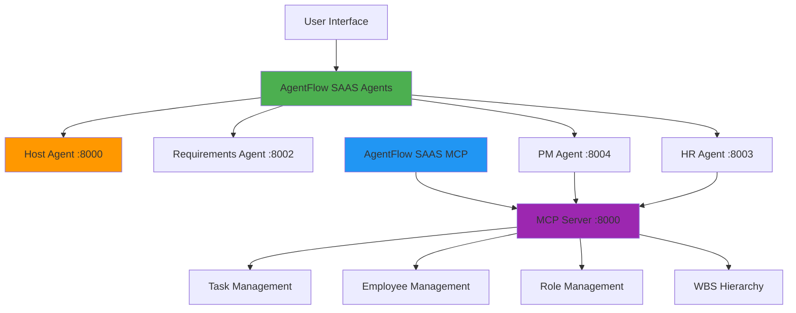

# 🤖 Agentic AI System

A comprehensive multi-agent AI system for Work Breakdown Structure (WBS) management, project orchestration, and human resource management. This repository contains two main components that work together to provide intelligent project management capabilities.

## 🏗️ System Architecture



## 📁 Repository Structure

```
Agentic-AI-System/
├── AgentFlow_SAAS_Agents/          # Multi-Agent System
│   ├── adk_host_agent/             # Host orchestration agent
│   ├── requirment_agent/           # WBS requirements generation
│   ├── pm_agent/                   # Project management agent
│   ├── hr_agent/                   # Human resource management
│   ├── webhook_server.py           # Airtable integration
│   └── requirements.txt            # Python dependencies
├── AgentFlow_SAAS_MCP/             # MCP Server System
│   ├── controllers/                # MCP tool controllers
│   ├── services/                   # Business logic layer
│   ├── models/                     # Data validation models
│   ├── utils/                      # Utility classes
│   ├── mcp_server.py              # Main MCP server
│   └── requirements.txt            # Python dependencies
└── README.md                       # This file
```

## 🚀 Quick Start

### Prerequisites

- Python 3.8+
- Git
- API Keys (Google/Gemini)

### 1. Clone Repository

```bash
git clone https://github.com/iamadityavarma/Agentic-AI-System.git
cd Agentic-AI-System
```

### 2. Setup AgentFlow SAAS Agents

```bash
cd AgentFlow_SAAS_Agents

# Install dependencies
pip install -r requirements.txt

# Create environment file
echo "GOOGLE_API_KEY=your_google_api_key_here" > .env
echo "GEMINI_API_KEY=your_google_api_key_here" >> .env

# Start agents in separate terminals
python run_requirements_agent.py    # Port 8002
python pm_agent_app.py              # Port 8004
python run_hr_agent.py              # Port 8003
python run_client_host_agent.py     # Port 8000
```

### 3. Setup AgentFlow SAAS MCP Server

```bash
cd ../AgentFlow_SAAS_MCP

# Install dependencies
pip install -r requirements.txt

# Configure API endpoint (optional)
export WBS_API_BASE_URL=http://117.248.109.35:5005

# Start MCP server
python mcp_server.py                # Port 8000 (SSE)
```

### 4. Access System

- **Web Interface**: http://localhost:8000 (Host Agent)
- **MCP Server**: http://127.0.0.1:8000 (MCP Tools)

## 🎯 Core Features

### 🤖 AgentFlow SAAS Agents

**Multi-Agent System with A2A Protocol Communication**

- **Host Agent** - Web interface and agent orchestration
- **Requirements Agent** - WBS requirements generation and analysis
- **Project Management Agent** - Task assignment and MCP integration
- **HR Resource Agent** - Employee management and candidate search
- **Webhook Server** - Real-time Airtable integration

**Key Capabilities:**
- ✅ Pure A2A Protocol Implementation
- ✅ Dynamic Agent Discovery
- ✅ Multi-Agent Orchestration
- ✅ Real-time Project Updates
- ✅ Comprehensive Error Handling

### 🛠️ AgentFlow SAAS MCP Server

**Model Context Protocol Server with 17 MCP Tools**

- **Task Management** - Three-level WBS hierarchy (Level 1-3)
- **Employee Management** - Complete employee database integration
- **Role Management** - CRUD operations for organizational roles
- **User Management** - Create and manage system users
- **Resource Planning** - Monthly hour allocation and cost tracking

**Key Capabilities:**
- ✅ 17 MCP Tools for comprehensive project management
- ✅ Three-level hierarchical task structure
- ✅ Employee integration with cost tracking
- ✅ Role-based access control
- ✅ API integration with external systems

## 🔄 System Integration

### Agent-to-MCP Communication Flow

```
User Request → Host Agent → Requirements Agent → PM Agent → MCP Server → API
                    ↓              ↓              ↓           ↓         ↓
              Web Interface → WBS Generation → Task Creation → Database → Response
```

### Data Flow

1. **User Input** - Web interface or direct API calls
2. **Agent Processing** - Multi-agent collaboration using A2A protocol
3. **MCP Integration** - Structured data operations via MCP tools
4. **API Persistence** - Data stored in external WBS management system
5. **Real-time Updates** - Webhook integration for live project updates

## 📊 Available MCP Tools

### Core Operations (17 Tools)

| Category | Tools | Description |
|----------|-------|-------------|
| **Task Management** | 4 tools | CRUD operations for WBS tasks |
| **Hierarchy Creation** | 3 tools | Level 1-3 task creation |
| **Employee Management** | 3 tools | Employee lookup and assignment |
| **WBS Configuration** | 1 tool | Available task options |
| **Role Management** | 5 tools | Complete role CRUD operations |
| **User Management** | 1 tool | Create new system users |

### Example Usage

```python
# Create complete project structure
level1 = await create_level_1_task(
    project_id=1,
    title="inception_report",
    description="G+10 residential complex project"
)

level2 = await create_level_2_task(
    project_id=1,
    title="surveys",
    parent_task_id=level1["data"]["id"]
)

level3 = await create_level_3_task_with_employee_lookup(
    project_id=1,
    title="topographical_survey",
    parent_task_id=level2["data"]["id"],
    employee_name_search="Vidyadhar",
    monthly_hours='[{"year": 2025, "month": "January", "plannedHours": 78}]'
)
```

## 🌐 API Integration

### External APIs

- **WBS Management API**: `http://117.248.109.35:5005`
- **Airtable Integration**: Real-time project data sync
- **Google/Gemini AI**: Natural language processing

### Supported Operations

- **Projects**: `/api/projects/{project_id}/wbs`
- **Employees**: `/api/resources/employees`
- **Roles**: `/api/role`
- **Users**: `/api/user/create`
- **WBS Options**: `/api/WBSOptions?formType=0`

## 🔧 Configuration

### Environment Variables

```bash
# AgentFlow SAAS Agents
GOOGLE_API_KEY=your_google_api_key_here
GEMINI_API_KEY=your_google_api_key_here
REQUIREMENTS_AGENT_URL=http://localhost:8002
WBS_AGENT_URL=http://localhost:8004
HR_AGENT_URL=http://localhost:8003
HOST_AGENT_PORT=8000

# AgentFlow SAAS MCP
WBS_API_BASE_URL=http://117.248.109.35:5005
```

### Port Configuration

| Service | Port | Protocol | Purpose |
|---------|------|----------|---------|
| Host Agent | 8000 | HTTP | Web interface |
| Requirements Agent | 8002 | A2A | WBS generation |
| HR Agent | 8003 | A2A | Resource management |
| PM Agent | 8004 | A2A | Project management |
| MCP Server | 8000 | SSE | MCP tools |
| Webhook Server | 5005 | HTTP | Airtable sync |

## 🧪 Testing & Verification

### Agent Communication Test

```bash
# Test A2A protocol communication
curl http://localhost:8002/.well-known/agent.json
curl http://localhost:8004/.well-known/agent.json
curl http://localhost:8003/.well-known/agent.json
```

### Web Interface Test

1. Open http://localhost:8000
2. Ask: "Is Project Management Agent responding?"
3. Expected: ✅ Task completed successfully

### MCP Tools Test

```python
# Test MCP server tools
from mcp_server import get_all_tasks, get_employees

tasks = await get_all_tasks(project_id=1)
employees = await get_employees("dummy")
```

## 📚 Documentation

### Detailed Guides

- **[AgentFlow_SAAS_Agents/README.md](AgentFlow_SAAS_Agents/README.md)** - Multi-agent system documentation
- **[AgentFlow_SAAS_MCP/README.md](AgentFlow_SAAS_MCP/README.md)** - MCP server documentation
- **[AgentFlow_SAAS_Agents/REQUIREMENTS_AGENT_GUIDE.md](AgentFlow_SAAS_Agents/REQUIREMENTS_AGENT_GUIDE.md)** - Requirements agent usage
- **[AgentFlow_SAAS_Agents/WBS_ORCHESTRATION_AGENT_GUIDE.md](AgentFlow_SAAS_Agents/WBS_ORCHESTRATION_AGENT_GUIDE.md)** - WBS orchestration guide

### Architecture Documents

- **[AgentFlow_SAAS_MCP/WBS_MCP_SERVER_CAPABILITIES.md](AgentFlow_SAAS_MCP/WBS_MCP_SERVER_CAPABILITIES.md)** - MCP server capabilities
- **[AgentFlow_SAAS_MCP/DEPLOYMENT.md](AgentFlow_SAAS_MCP/DEPLOYMENT.md)** - Deployment instructions
- **[AgentFlow_SAAS_MCP/WINDOWS_DEPLOYMENT_GUIDE.md](AgentFlow_SAAS_MCP/WINDOWS_DEPLOYMENT_GUIDE.md)** - Windows deployment

## 🚀 Production Deployment

### Docker Support

Both systems include Docker configurations:

```bash
# AgentFlow SAAS Agents
cd AgentFlow_SAAS_Agents
docker-compose up -d

# AgentFlow SAAS MCP
cd AgentFlow_SAAS_MCP
docker-compose up -d
```

### Cloud Deployment

- **Host Agent**: Web interface accessible via load balancer
- **MCP Server**: SSE transport for real-time communication
- **API Integration**: External WBS management system
- **Database**: SQLite for local storage, external APIs for persistence

## 🤝 Contributing

1. Fork the repository
2. Create feature branch (`git checkout -b feature/amazing-feature`)
3. Follow existing code patterns and documentation
4. Test both agent communication and MCP tools
5. Commit changes (`git commit -m 'Add amazing feature'`)
6. Push to branch (`git push origin feature/amazing-feature`)
7. Open Pull Request

### Development Guidelines

- **Agent System**: Follow A2A protocol patterns
- **MCP Server**: Maintain 17-tool compatibility
- **Code Style**: PEP8 with 100-character line limit
- **Testing**: Verify agent communication and MCP integration
- **Documentation**: Update relevant README files

## 📄 License

This project is licensed under the MIT License - see individual component licenses for details.

## 👨‍💻 Author

**Aditya Ganapathiraju** ([@iamadityavarma](https://github.com/iamadityavarma))

- Data Science & Business Analytics @ Wayne State University
- Former Technology Analyst @ Infosys
- Passionate about Data, Tech, and Music

## 🔗 Links

- **GitHub Repository**: https://github.com/iamadityavarma/Agentic-AI-System
- **LinkedIn**: [in/aditya-varma-a01a56116](https://linkedin.com/in/aditya-varma-a01a56116)
- **Twitter**: [@iamadityavarma1](https://twitter.com/iamadityavarma1)

---

## 🎯 System Status

| Component | Status | Version | Last Updated |
|-----------|--------|---------|--------------|
| AgentFlow SAAS Agents | ✅ Production Ready | v2.0 | 2025-01-18 |
| AgentFlow SAAS MCP Server | ✅ Production Ready | v1.0 | 2025-01-18 |
| A2A Protocol | ✅ Working | Latest | 2025-01-18 |
| MCP Integration | ✅ Working | 17 Tools | 2025-01-18 |
| API Integration | ✅ Connected | Live | 2025-01-18 |

**Ready for professional WBS requirements generation and project management!** 🚀
